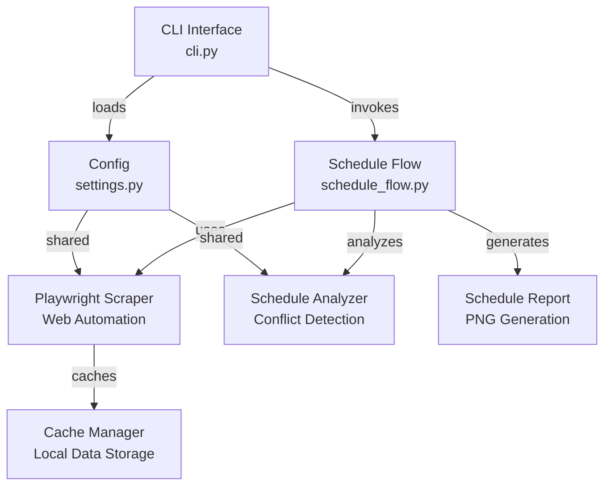

# Schedule Checker (FEU Tech SOLAR)

A smart schedule availability analyzer for FEU Tech SOLAR. Checks class schedules and generates visual reports to identify conflict-free time slots.

## Features

- Real-time schedule scraping from FEU SOLAR portal
- Conflict detection and analysis
- Group-based schedule compatibility checking
- PNG schedule report generation for easy sharing
- Configurable group size analysis
- Optional professor mapping from Excel exports

## Quick Start

```bash
pip install -r requirements.txt
playwright install chromium
```

```bash
schedule-checker --group-size 3 --image-output src/.cache/schedule_report.png
```

## Documentation

For detailed usage and configuration, see:

- [Getting Started Guide](docs/getting-started.md)
- [Schedule Checker Documentation](docs/schedule-checker.md)
- [Configuration Reference](docs/configuration.md)

## Architecture (UML)



## Tech Stack

- **Python 3.10+**: Core language
- **Playwright**: Browser automation & web scraping
- **Rich**: Terminal UI & formatting
- **Pillow**: Image manipulation
- **openpyxl**: Excel data parsing
- **SQLite**: Local caching

## Requirements

- Python 3.10 or higher
- Playwright browser binaries (installed via `playwright install`)
- FEU Tech account for SOLAR access
